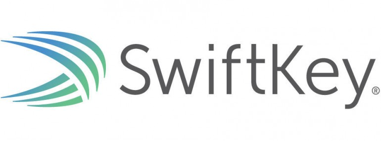
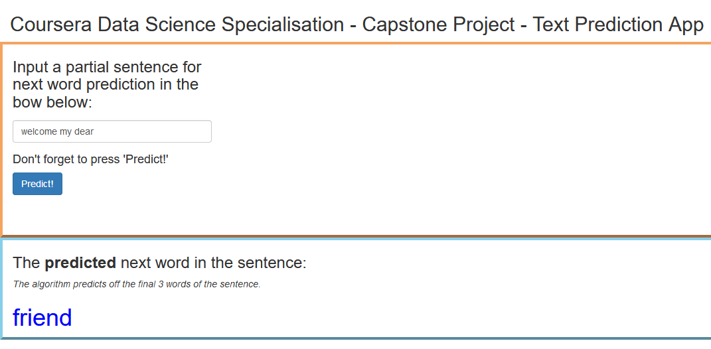

## Project Description

- The goal of this project was to build a text prediction app using all of the knowledge learnt in the course.
- It involved applying the principles of natural language processing to build a model. 
- This model is then used by the app to predict the next word in a user-input sentence. 
- All of this R code is then enclosed in a shiny app so that it is easy to use.

  
This project is in conjunction with the industry partner SwiftKey.

{}

## Dataset Pre-processing

The training data for this model was processed with the following steps. The input sentence to the app is processed in the same way.

1. Emails and symbols / punctuation are removed.
2. All the text is converted to lower case.
3. Numbers are removed.
4. Words with 3 or more repeated letters are removed.
5. Words are contracted to popular word contractions to improve model power
	- i.e. you are -> youre
	- This reduces these potential contractions to one word so they have less effect on the model.
6. Any remaining single letters are removed.
7. Profanity words are removed.
8. Words longer than 15 letters are removed.
9. Extra whitespace is removed.

Link to code:
<https://github.com/dpjmullins/CourseraDataScienceCapstone/blob/master/preprocessing_functions.R>

## Algorithm

- The algorithm used was a back-off N-gram model using 4 to 1 N-grams. 
- It uses a frequency-based scoring system to decide on the best response word to predict for the input sentence.
- The model uses the final 3 words of a processed sentence as a predictor.
- Model:
	- It first searches the quadgram model for a response word. 
	- If no word is found, then the model searches the trigram model for a response word.
	- It still no word is found, the model searches the bigram model.
	- If no word is found, the most frequent word in the training data ('the') is returned.
- The function predictor.func() controls the processing of the input sentence and prediction of the next word.
- The algorithm is limited to be basic and small in size due to the need to host the app on the free Shiny servers.
- Performance would improve if a greater amount of training data could be used.

 

Link to model:
<https://github.com/dpjmullins/CourseraDataScienceCapstone/blob/master/02_ngram_modelling.R>

Link to prediction function:
<https://github.com/dpjmullins/CourseraDataScienceCapstone/blob/master/03_prediction.R>

## Application Interface

- Input text in the box where 'welcome my dear' is in the screenshot.
- The predicted word is shown in large blue text.
- The predicted sentence here is 'welcome my dear **friend**'.

<!--html_preserve-->

<!--/html_preserve-->

Link to shiny app:
<https://dpjmullins.shinyapps.io/ds_capstone_app/>

